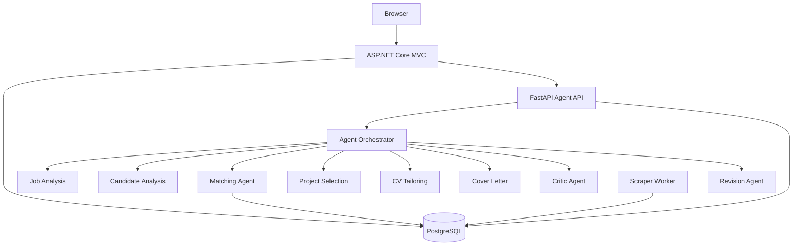

# JobFinder

A full-stack job discovery, matching, recommendation, and AI-assisted application preparation platform.

JobFinder combines an **ASP.NET Core MVC frontend**, **Python/FastAPI agent services**, **PostgreSQL**, job scraping, deterministic skill matching, personalized recommendations, and a multi-agent application-generation pipeline.

## Features

* User registration and cookie-based authentication
* Candidate profile with skills and portfolio projects
* Job ingestion from Arbeitnow and PNet
* Normalized jobs, companies, and skills in PostgreSQL
* Required/preferred skill matching
* Deterministic **80% required / 20% preferred** matching
* Ranked job recommendations
* Location filtering
* Application tracking
* Duplicate application protection
* AI-assisted application preparation
* Candidate/job analysis
* Project selection
* CV tailoring recommendations
* Tailored cover-letter generation
* Critic/revision validation loop
* Generated DOCX CV and cover letter
* Versioned application documents
* Docker Compose orchestration for web, API, scraper, and PostgreSQL

## Architecture



## Technology Stack

### Frontend

* C#
* ASP.NET Core MVC
* Razor Views
* Entity Framework Core
* Bootstrap

### Backend

* Python
* FastAPI
* Pydantic
* Custom multi-agent architecture
* OpenRouter LLM integration

### Data

* PostgreSQL
* Entity Framework Core
* SQLAlchemy

### Ingestion

* Arbeitnow API
* PNet
* Playwright
* Scrapy

### Deployment

* Docker
* Docker Compose

## Application Generation Pipeline

The application-preparation workflow is intentionally hybrid.

```text
User + Job
   ↓
Job Analysis
   ↓
Candidate Analysis
   ↓
Deterministic Matching
   ↓
 ┌───────────────────────┐
 │ Project Selection     │
 │ CV Tailoring          │
 └───────────────────────┘
   ↓
Cover Letter
   ↓
Critic
   ↓
Revision when required
   ↓
Final Application Package
   ↓
MVC
   ↓
PostgreSQL
   ↓
DOCX Documents
```

Deterministic processing is used where predictable results are preferable, particularly for skill matching and candidate evidence. LLMs are used for language-generation and tailoring tasks.

## Matching

JobFinder calculates candidate/job compatibility using weighted skill overlap.

```text
Required skills: 80%
Preferred skills: 20%
```

The matching process identifies:

* Matched required skills
* Missing required skills
* Matched preferred skills
* Missing preferred skills
* Overall match score

This result is then used by the recommendation and application-preparation flows.

## Job Application Workflow

```text
Job Details
   ↓
Apply
   ↓
Application Created
   ↓
Generate Application
   ↓
Review
   ↓
Approve
   ↓
Applied
   ↓
Download CV / Cover Letter
```

Applications are associated with both the authenticated user and target job, with a uniqueness rule preventing duplicate application records for the same user/job combination.

## Project Structure

```text
JobFinder/
├── JobFinder/
│   ├── Controllers/
│   ├── Data/
│   ├── Models/
│   ├── Services/
│   ├── ViewModels/
│   └── Views/
│
├── python-services/
│   ├── app/
│   │   ├── agents/
│   │   ├── database/
│   │   ├── llm/
│   │   ├── routers/
│   │   ├── schemas/
│   │   ├── scraper/
│   │   └── services/
│   ├── Dockerfile
│   ├── Dockerfile.scraper
│   ├── requirements.txt
│   └── .env.example
│
└── compose.yaml
```

## Running with Docker

### Requirements

* Docker Desktop
* Docker Compose

### Configuration

Copy the example environment file and provide your local values.

```powershell
cp .env.example .env
```

Set the required values, including the OpenRouter API key.

### Start the application

From the repository root:

```powershell
docker compose up --build
```

The application is exposed through:

```text
http://localhost:7176
```

FastAPI is exposed through:

```text
http://localhost:8000
```

The PostgreSQL database runs inside the Compose network.

### Stop the application

```powershell
docker compose down
```

### Rebuild from scratch

```powershell
docker compose down
docker compose build --no-cache
docker compose up -d
```

### Check service status

```powershell
docker compose ps
```

Expected services:

```text
db        healthy
api       healthy
web       running
scraper   running
```

## API Endpoints

### Health

```text
GET /health
```

### Recommendations

```text
GET /api/agents/recommendations/{user_id}
```

### Job Matching

```text
POST /api/agents/match-job
```

### Application Preparation

```text
POST /api/agents/prepare-application
```

## Reliability

The application-generation pipeline includes defensive handling for unreliable LLM providers.

The LLM service supports:

* Primary and fallback models
* Bounded retry behavior
* Rate-limit handling
* Timeout handling
* Empty-response detection
* JSON extraction and validation

The application client also provides deterministic fallback processing when the AI service cannot return a valid response.

This allows the core application workflow to continue even when an external LLM provider is temporarily unavailable.

## Security

The project uses:

* Password hashing
* Cookie authentication
* Authenticated-user ownership checks
* `[Authorize]` protected controllers
* Anti-forgery tokens on state-changing MVC forms
* Environment-based secrets
* Validation through MVC models and FastAPI/Pydantic request schemas

Production deployments would additionally require deployment-specific secret management, HTTPS, service-to-service authentication, rate limiting, and centralized logging.

## Validation

The current implementation has been manually validated across the primary full-stack flows:

```text
Authentication              ✓
Job ingestion               ✓
Job browsing                ✓
Job details                 ✓
Recommendations             ✓
Location filtering          ✓
Application creation        ✓
AI application generation   ✓
Application review          ✓
Application approval        ✓
Application persistence     ✓
DOCX CV generation          ✓
DOCX cover-letter generation✓
Document downloads          ✓
Duplicate application guard ✓
Docker Compose              ✓
GitHub deployment           ✓
```

## Known Limitations

* Free LLM providers may impose rate limits or temporary availability constraints.
* PNet scraping can be affected by external network/browser behaviour.
* The scraper is designed for the supported sources and is not a universal job-board crawler.
* Production deployment would require stronger infrastructure-level security and observability.

## Portfolio Value

JobFinder demonstrates practical software-engineering concepts across multiple technologies rather than being a single-framework CRUD application.

Key areas demonstrated include:

* Full-stack MVC development
* REST API integration
* Microservice-style architecture
* Relational database design
* Entity Framework Core
* Python/FastAPI services
* Web scraping
* Deterministic recommendation algorithms
* Multi-agent LLM orchestration
* Structured API contracts
* Error handling and fallbacks
* Document generation
* Docker containerization
* Git/GitHub workflow
